# Expense Project with Terraform:

## Project infrastructure: terraform-infra-dev

01. Created VPC with name as expense-dev with terraform code.
02. Created below Security groups inside the VPC.
03. Created a bastion server with below packages installed.
- Mysql
04. Create a RDS with MySQL.
05. Created a VPN using the OpenVPN application in public subnet.
    - NOTE: In real time, there will be a separate team to handle the VPN part. We don’t do any VPN installations and configuration. But, just for awareness better to know the process.
    - When the user connected to the VPN then users IP shows like user is in that specific VPC.
    - Creating VPN:
        - OpenVPN provides one instance as an AMI in AWS free tier. We need to subscribe to that AMI as it’s an AWS Marketplace AMI (It's free only when we are in aws free tier). Otherwise, we will get below error.
        - Search for the AMI and Click on the AWS Marketplace AMI.
        - Click on the AMI name url and then click on Subscribe now.
        
        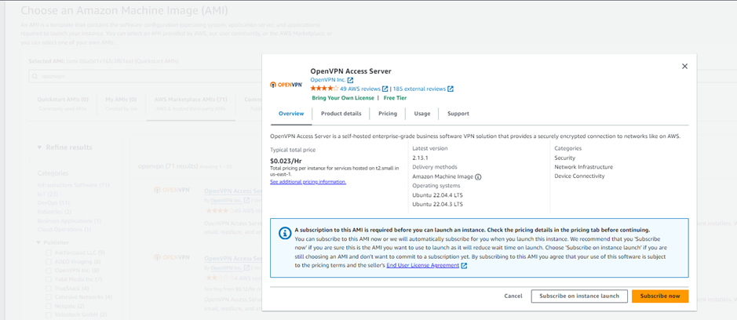

        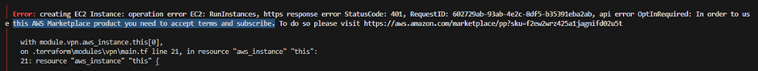

        - Its written in ubuntu based. We have to use the “OpenVPN Access Server” AMI.
        - Default Creds to login to the instance:
            - Username: openvpnas
            - Password: It’s a key based AMI. We must provide the key.
                - We can use the existing key-pair or we can create new one also in .ssh folder in user’s home directory in our local system by using below command.
                    
                        ssh-keygen –f openvpn
                
                - It will generate two key files, 1 with .pub and 1 without any extension.
                - Attach this .pub key file to the aws if the openvpn instance is creating manually.
                - Attach this .pub key file to the terraform script using the resource “aws_key_pair” if we are using terraform to create the openvpn instance.

                    Syntax:

                            resource “aws_key_pair” “<name>”{
                                key_name = <key-name>
                                public_key = <content-from-.pub-file>
                                        Or
                                public_key = <.pub-file-path>
                            }
                
                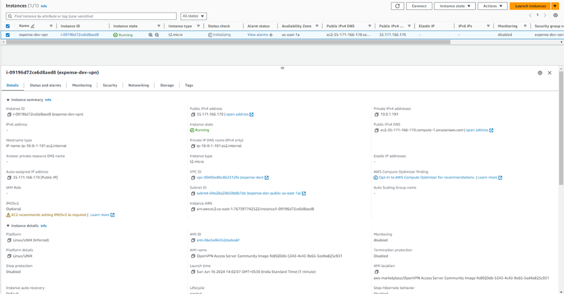

    - Login to the vpn instance using ssh and set the password.

        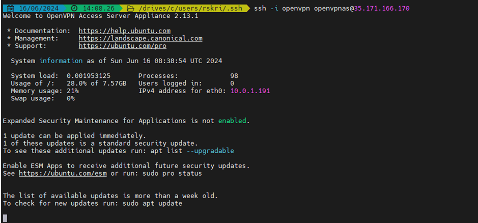

        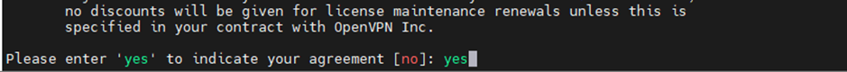

        - Then keep on pressing Enter key wherever it's asked for confirmation.
        - Set the password otherwise it will create a random password.

            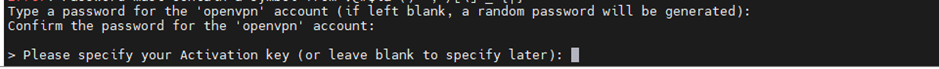

            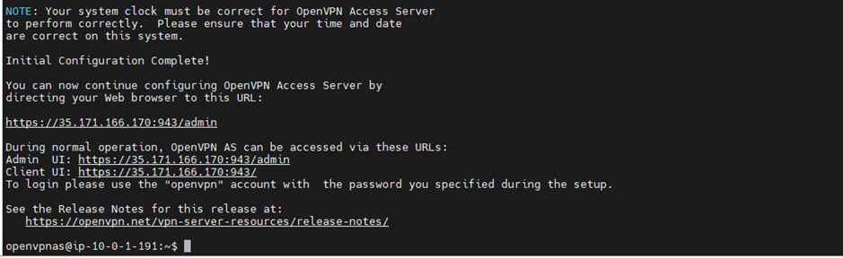

    - Login to the above admin UI using the above url mentioned in the above screen.
        - Credentials for login:
            - Username: openvpn
            - Password: What we set above.

            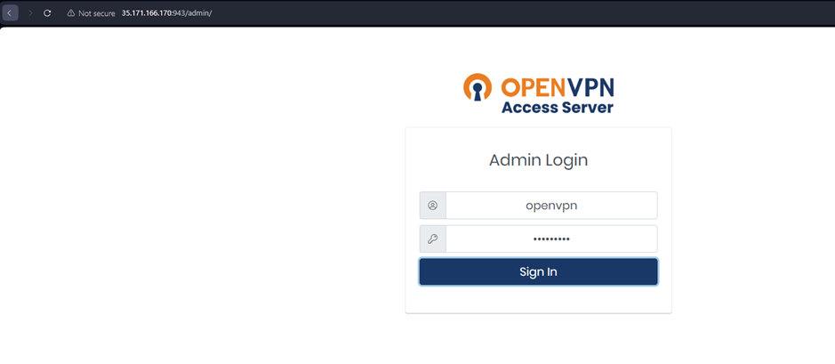

        - Click on Agree in the next screen

        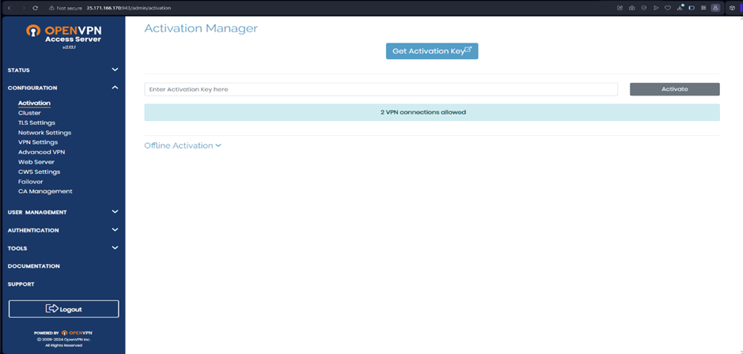

        - Click on VPN Settings under Configuration on LHS.
        - Toggle “Should the client internet traffic be routed through VPN?”

        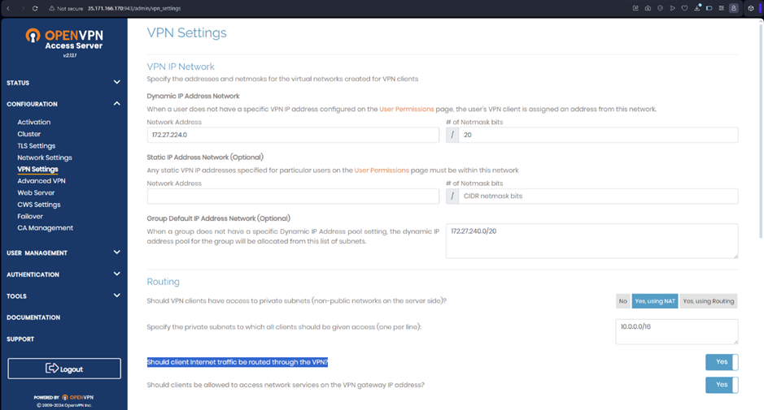

        - Toggle Have clients use specific DNS servers.
        - Enter the Primary DNS Server as 8.8.8.8 and Secondary DNS Server as 8.8.4.4.
        - Click on Save Settings.

        

        - Click on Update Running Server.

        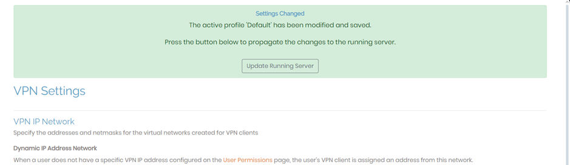

        - We will get the Running Server Updated message.

        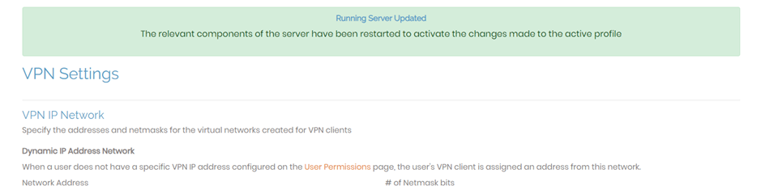

    - **NOTE: In the latest version of openvpn, we have to perform this setting as part of the initial configuration only.**
    
        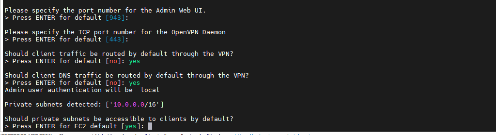

    - Download the OpenVPN Connect application and install it into the local laptop. 
        - https://openvpn.net/client/client-connect-vpn-for-windows/

        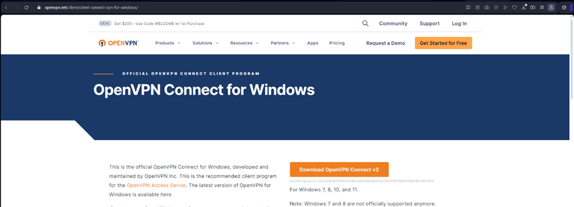

        - Open the OpenVPN application and select Via URL tab and enter the Client UI url showing in the instance screen above.
        - Click on Next. 

        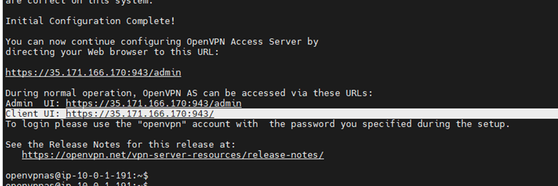

        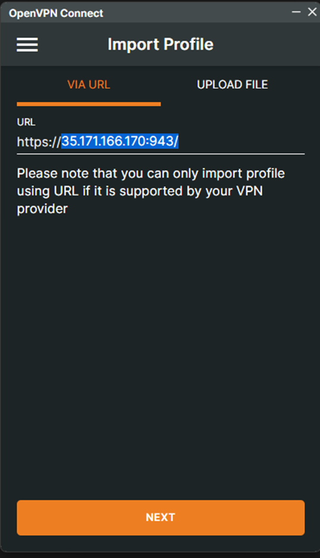

        - Accept the confirmation on certificate.

        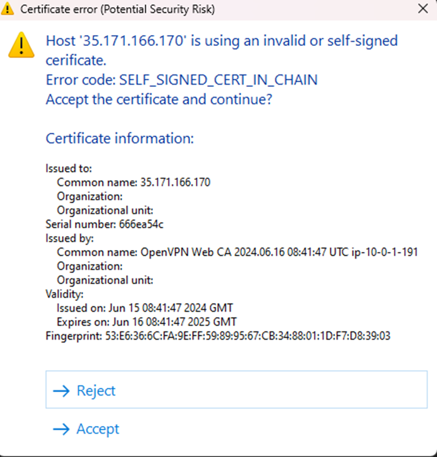

        - Ener the login credentials.
            - Username: openvpn
            - Password: Which we set above.
        - Check profile name and port number.
        - Select Import autologin profile and Connect after import checkboxes if required.
        - Click on Import

        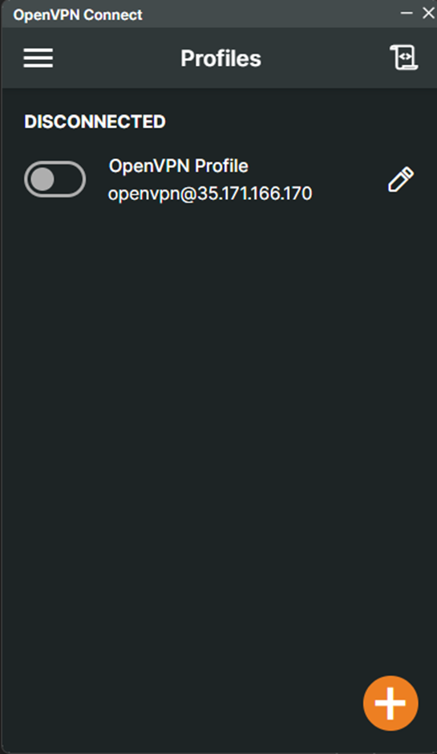

        - Check that current IP address of the laptop.

        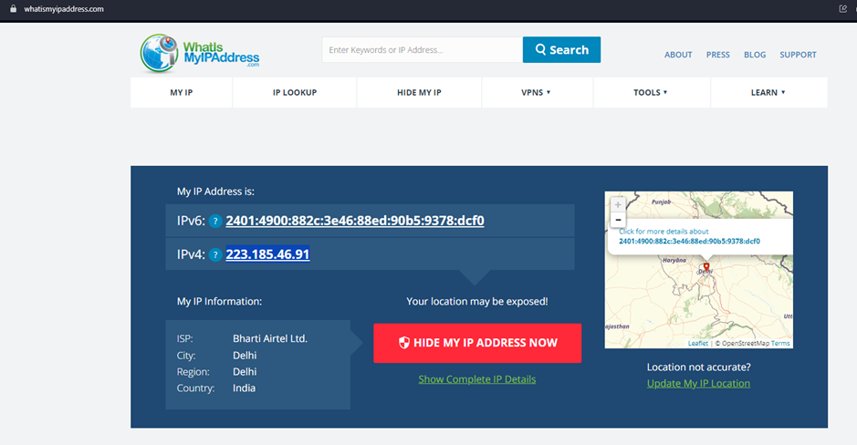

        - Connect to the VPN.
            - Toggle the button.
            - Enter the Password which we set above.

        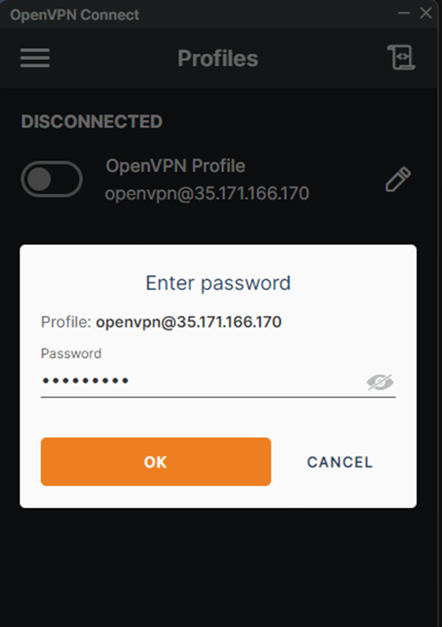

        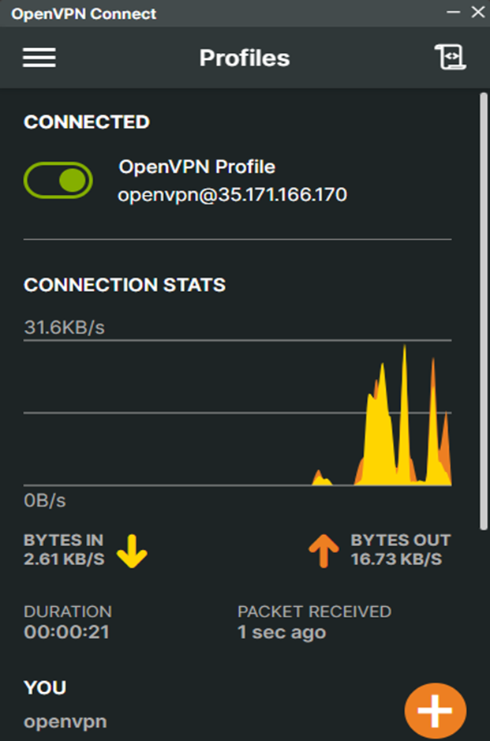

        - Check the laptop IP address now.
            - Now, our location will be shows as the location of the region where the OpenVPN instance is created inside the VPC.
            - With this we can directly connect to the backend alb or backend servers without using the bastion server.

            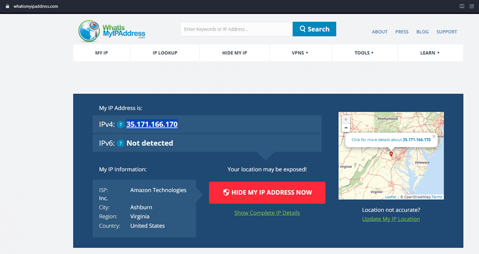

06. Created app alb load balancer and created a listener inside the alb.

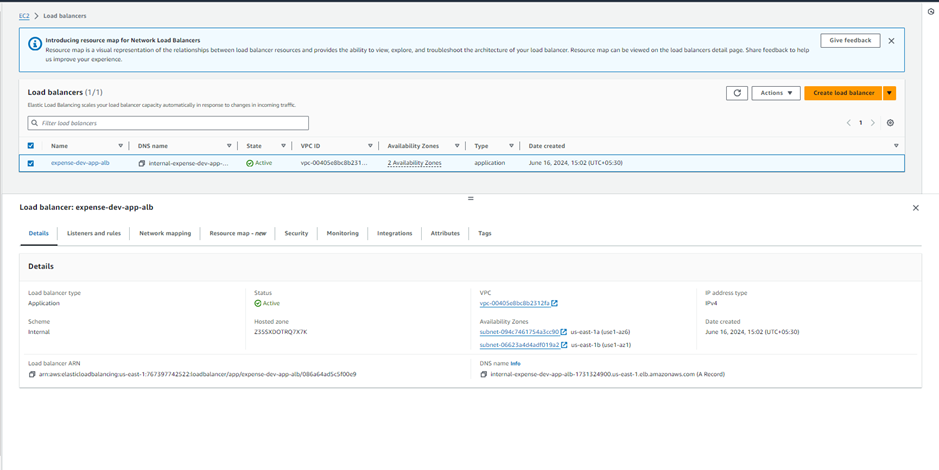

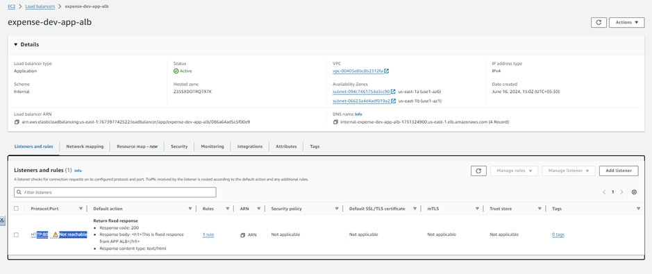

Check that user is able to access the application using the DNS name of the alb when VPN is connected.

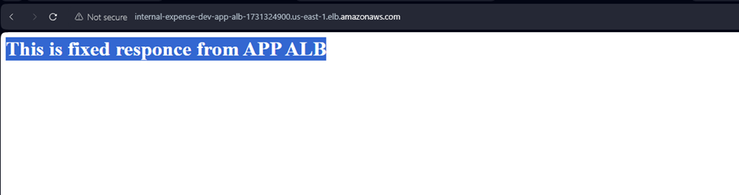

Disconnect the VPN.

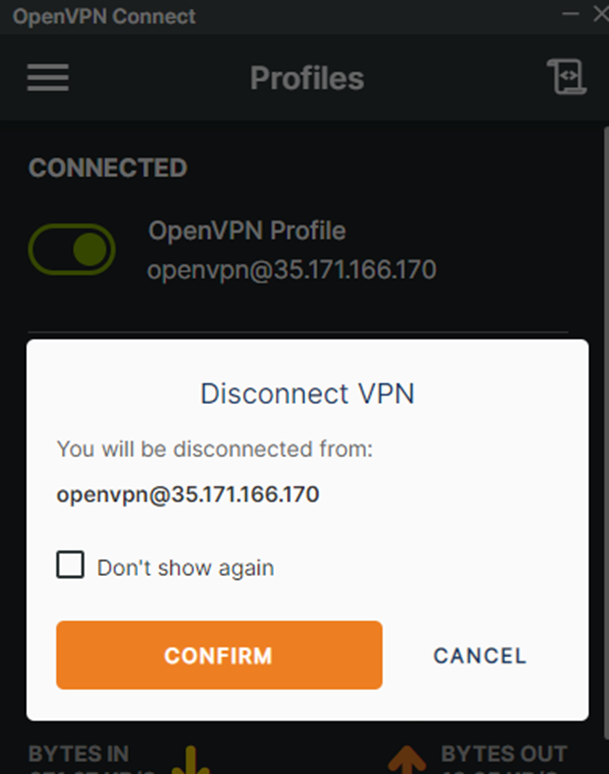   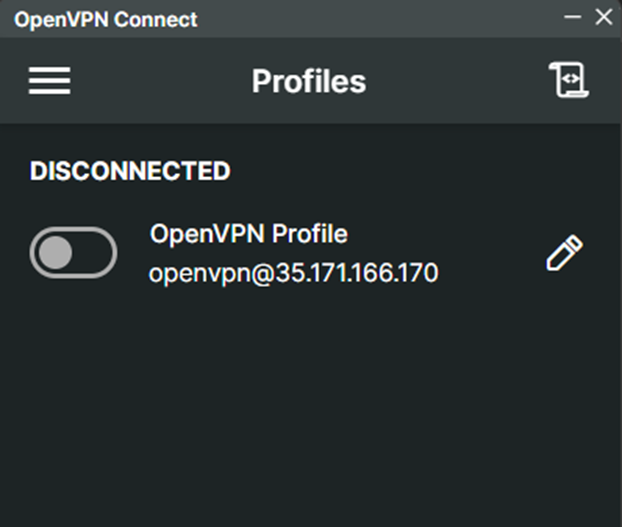

Check that application is accessible now.

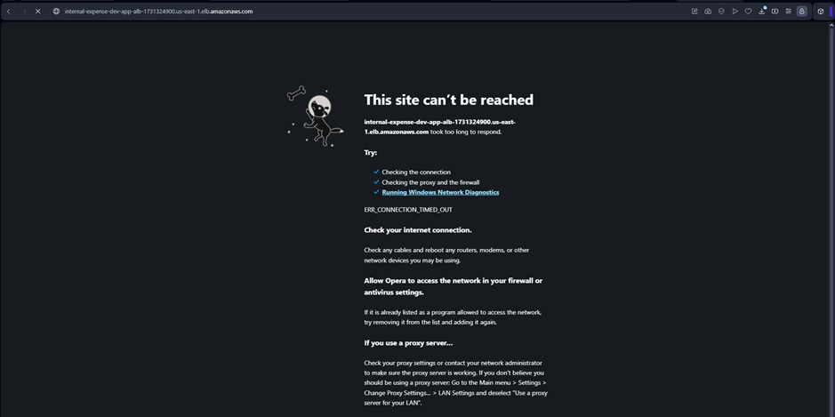

As the above alb url is NOT user friendly to remember and for security also, we need to create a R53 record with *.<domain-name> to access the application with any component.

## Application Infrastructure: terraform-infra-dev

- Backend:
    - Create instance.
    - Configure it using Ansible.
    - Stop the instance.
    - Take the AMI of the instance.
    - Delete the instance.
    - Create a backend target group.
    - Create a backend Launch Template.
    - Create backend Auto Scaling.
    - Create backend Auto Scaling Policy.
    - Create a backend listener rule 
        - When the request come on port 80 with backend.<domain-name> then the redirect that request to the backend target group.

07. Configure a backend server. NOTE: We should be connected to VPN while configuring the backend as backend is the private server.

    - Create an EC2 instance for backend.
    - Configure the instance using ansible, terraform null_resource.
        - By using user data
            - In this option, AWS will run the user data script after the instance is created.
            - Disadvantages:
                - We can’t check logs while running user data script without login to instance.
                - If we update the user data script, AWS will not update the same in the EC2 instance. We have to delete the instance and run terraform again for the latest changes.
                - User data will be useful for a small configurations like installing any packages.

        - By using remote-exec provisioner:
            - In this option, AWS will execute the scripts in the remote server.
            - We use null_resource:
                - This will not create any infrastructure, but it will be useful to run local-exec, remote-exec and file provisioners.

                Syntax:

                    resource “null_resource” ”<name>”{
                        triggers = {
                            <triggers>
                        }
                        connection {
                            <connection-settings>
                        }
                        provisioner “<provisioner-name>”{
                            <provisioner-scripts>
                        }
                    }
    - Connect to the server using null_resource and remote-exec and connect to the VPN. Without VPN we cannot perform below steps.
    - Copy the script file into the instance using file provisioner.

        Syntax:

            provisioner "file" {
                source = "<file-source-path>"
                destination = "<file-destination-path>"
            }

        Ex:

            provisioner "file" {
                source = "backend.sh"
                destination = "/tmp/backend.sh"
            }
    - Run the file which was copied into /tmp/ using remote-exec.

        Syntax:

            provisioner “remote-exec” {
                inline = [ 
                    <commands>
                ]
            }

        Ex:

            provisioner "remote-exec" {
                inline = [
                    "chmod +x /tmp/backend.sh",
                    "sudo sh /tmp/backend.sh"
                ]
            }

    - In general, in ansible push model, we will install the ansible in the master node and run the below command from the master to push the changes to the remote node by connecting to the instances mentioned in inventory file.

            ansible-playbook -i <inventory> <yaml-file> -e var=value

    - Create an ansible-pull model to get the changes into the remote node.
        - Install the ansible in remote node.
        - Run below command in in the remote node directly.
                
                ansible-pull –i <inventory> -U <ansible-play-git-url> <yaml-file> -e var=value
    
    - Stop the server.

            resource "aws_ec2_instance_state" "backend" {
                instance_id = module.backend.id
                state = "stopped"
                # Stop the server only when the null resource is completed.
                depends_on = [ null_resource.backend ]  
            }
    
    - Take the AMI of the stopped server.

            resource "aws_ami_from_instance" "backend" {
                name = "${var.project_name}-${var.environment}-${var.common_tags.Componenet}"
                source_instance_id = module.backend.id
                depends_on = [ aws_ec2_instance_state.backend ]
            }

    - Delete the server.
        - To delete the server, we don’t have any resource hence we are using the provisioner option and AWS CLI command to terminate the instance as a local-exec.

                resource "null_resource" "backend-delete" {
                    triggers = {
                        instance_id = module.backend.id   # This will be triggered every time when the instance is created.
                    }
                    connection{
                        type = "ssh"
                        user = "ec2-user"
                        password = "DevOps321"
                        host = module.backend.private_ip
                    }
                    provisioner "local-exec" {
                        command = "aws ec2 terminate-instances --instance-ids 	${module.backend.id}"
                    }
                    depends_on = [aws_ami_from_instance.backend]
                }

    - If we apply at this stage when the state is stopped, actual state (stopped) and declared state (create) will not be matched. Terraform will terminate the instance irrespective of the state.
    - If we apply again when the state is terminated, it will create a new instance perform below actions.
        - Configure the instance
        - Stop the instance
        - Take the AMI
        - Delete the server.

    - Create target group with health check.
    
            resource "aws_lb_target_group" "backend" {
                name = "${var.project_name}-${var.environment}-${var.common_tags.Componenet}"
                port = 8080
                protocol = "HTTP"
                vpc_id = data.aws_ssm_parameter.vpc_id.value
                health_check {
                    path = "/health"
                    port = 8080
                    protocol = "HTTP"
                    healthy_threshold = 2
                    unhealthy_threshold = 2
                    matcher = "200"
                }
            }
    - Create Launch template.

            resource "aws_launch_template" "backend" {
                name = "${var.project_name}-${var.environment}-${var.common_tags.Componenet}"
                image_id = aws_ami_from_instance.backend.id
                instance_initiated_shutdown_behavior = "terminate"
                instance_type = "t2.micro"

                vpc_security_group_ids = [data.aws_ssm_parameter.backend_sg_id.value]

                tag_specifications {
                    resource_type = "instance"
                    tags = merge(
                    var.common_tags,
                        {
                         Name = "${var.project_name}-${var.environment}-${var.common_tags.Componenet}"
                        }
                    )
                }  
            }
    - Create Auto Scaling Group.

            resource "aws_autoscaling_group" "backend" {
                name = "${var.project_name}-${var.environment}-${var.common_tags.Componenet}"
                min_size = 1
                max_size = 5
                health_check_grace_period = 60
                health_check_type = "ELB"
                desired_capacity = 1
                target_group_arns = [aws_lb_target_group.backend.arn]
                launch_template {
                    id = aws_launch_template.backend.id
                    version = "$Latest"
                }
                vpc_zone_identifier = split(",",data.aws_ssm_parameter.private_subnet_ids.value)

                instance_refresh {
                    strategy = "Rolling"
                    preferences {
                        min_healthy_percentage = 50
                    }
                    triggers = ["launch_template"]
                }

                tag {
                    key = "Name"
                    value = "${var.project_name}-${var.environment}-${var.common_tags.Componenet}"
                    propagate_at_launch = true
                }

                timeouts {
                    delete = "15m"
                }

                tag {
                    key = "Project"
                    value = "${var.project_name}"
                    propagate_at_launch = true
                }
            }

        - Create auto scaling group policy.

                resource "aws_autoscaling_policy" "backend" {
                    name = "${var.project_name}-${var.environment}-${var.common_tags.Componenet}"
                    policy_type = "TargetTrackingScaling"
                    autoscaling_group_name = aws_autoscaling_group.backend.name

                    target_tracking_configuration {
                        predefined_metric_specification {
                        predefined_metric_type = "ASGAverageCPUUtilization"
                        }
                        target_value = 10.0
                    }
                }

        - Create listener rule in load balancer.

                resource "aws_lb_listener_rule" "backend" {
                    listener_arn = data.aws_ssm_parameter.app_alb_listener_arn.value
                    priority = 100    # Less number will be first validated.

                    action {
                        type = "forward"
                        target_group_arn = aws_lb_target_group.backend/arn
                    }
                    condition {
                        path_pattern {
                            values = ["backend.app-${var.environment}.${var.zone_name}"]
                        }
                    }
                }

    7.1 Create certificate to provide the https protocol to the application.
    - Create ACM Certificate:

            resource "aws_acm_certificate" "expense" {
                domain_name = "*.domain.com"
                validation_method = "DNS"

                tags = merge(
                    var.common_tags,
                    {
                        Name = "${var.project_name}-${var.environment}"
                    }
                )
            }
    - Update the records in the domain.

            resource "aws_route53_record" "expense" {
                for_each = {
                    for dvo in aws_aws_acm_certificate.expense.domain_validation_options : dvo.domain_name {
                        name = dvo.resource_record_name
                        record = dvo.resource_record_value
                        type = dvo.resource_record_type
                    }
                }
                allow_overwrite = true
                name = each.value.name
                records = [each.value.record]
                ttl = 1
                type = each.value.type
                zone_id = var.zone_id
            }
    - Perform the automatic validation.

            resource "aws_acm_certificate_validation" "expense" {
                certificate_arn = aws_acm_certificate.expense.arn
                validation_record_fqdns = [for record in aws_route53_record.expense : record.fqdns]
        }
        
08. Create web load balancer. And configure as we did for app load balancer.

    8.1 Check that application is working.

09. Create frontend instance. And configure it as we did for backend instance.

